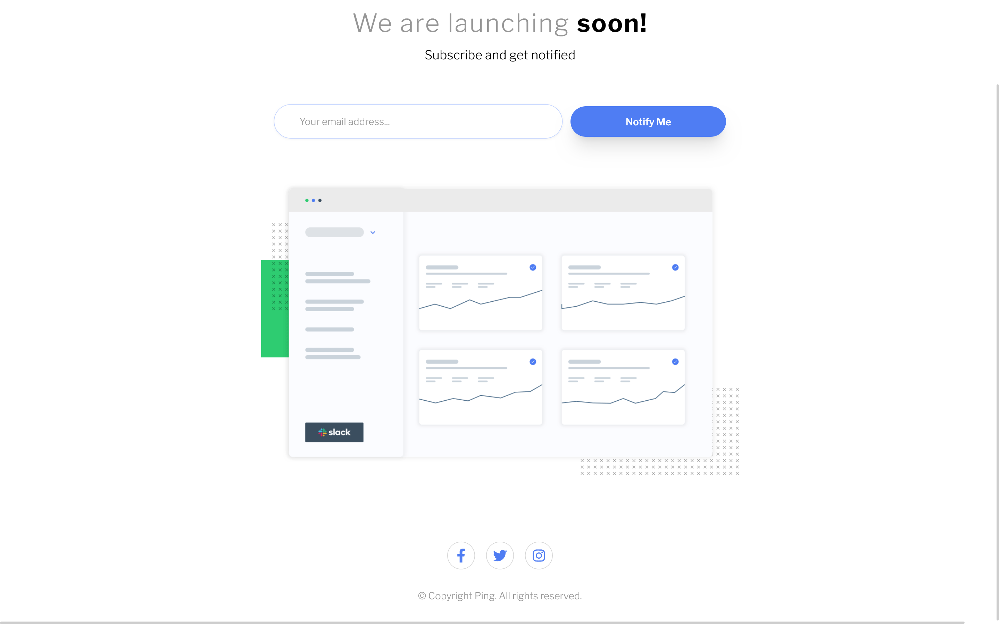
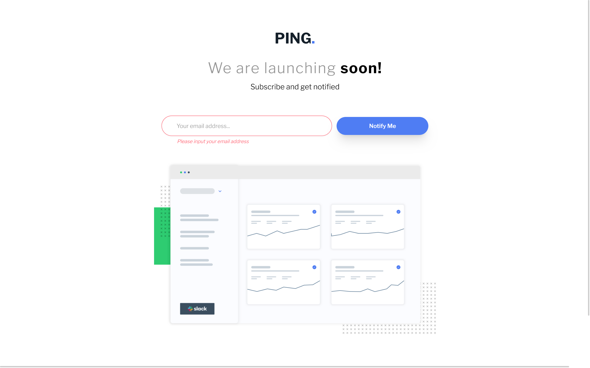
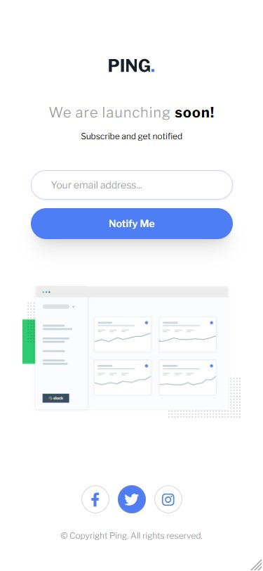
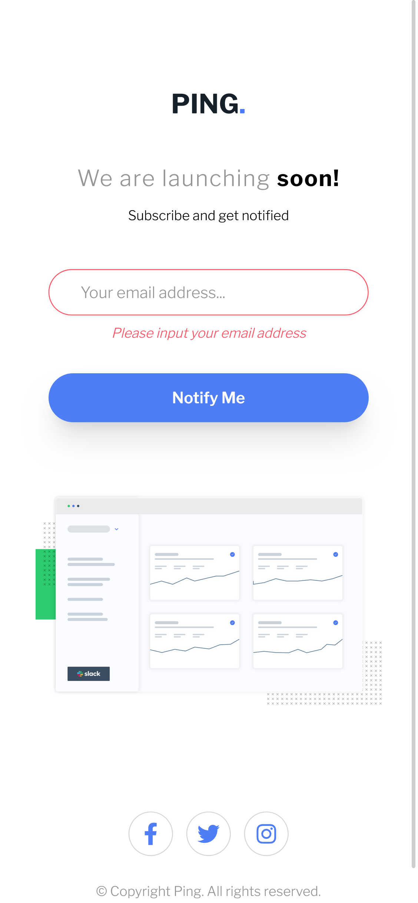

# Frontend Mentor - Ping coming soon page solution

This is a solution to the [Ping coming soon page challenge on Frontend Mentor](https://www.frontendmentor.io/challenges/ping-single-column-coming-soon-page-5cadd051fec04111f7b848da). Frontend Mentor challenges help you improve your coding skills by building realistic projects.

## Table of contents

- [Overview](#overview)
  - [The challenge](#the-challenge)
  - [Screenshot](#screenshot)
  - [Links](#links)
- [My process](#my-process)
  - [Built with](#built-with)
  - [What I learned](#what-i-learned)
  - [Useful resources](#useful-resources)
- [Author](#author)
- [Acknowledgments](#acknowledgments)

## Overview

### The challenge

Users should be able to:

- View the optimal layout for the site depending on their device's screen size
- See hover states for all interactive elements on the page
- Submit their email address using an `input` field
- Receive an error message when the `form` is submitted if:
  - The `input` field is empty. The message for this error should say _"Whoops! It looks like you forgot to add your email"_
  - The email address is not formatted correctly (i.e. a correct email address should have this structure: `name@host.tld`). The message for this error should say _"Please provide a valid email address"_

### Screenshot

- Desktop version.
  
  

- Mobile version.
  
  

### Links

- Solution URL: [Source code on Github](https://github.com/Abaljerind/ping-coming-soon-page)
- Live Site URL: [Ping Coming Soon Page Component](https://ping-coming-soon-page-git-main-abaljerind.vercel.app/)

## My process

### Built with

- Semantic HTML5 markup
- [TailwindCSS](https://tailwindcss.com/) - For styles
- [FontAwesome](https://fontawesome.com/)
- Flexbox

### What I learned

This is the first time i use utility class from tailwindcss, which is called 'group' to make a group of parent tags and child tags as one. This code below will make the span which is a circle can also get hover effect even if the user hasn't reached the tag i which is the icon of facebook. And for the javascript code, i use it to make the border color and the error text back to normal as it before clicked by the user.

```html
<h1>Some code I'm proud of</h1>
```

```html & css
<span
  class="medias group w-10 h-10 border-gray border border-opacity-40 rounded-full leading-10 inline-flex items-center justify-center duration-1000 transition hover:text-white hover:bg-blue hover:ease-in-out"
>
  <i class="fa-brands fa-facebook-f fa-lg group-hover:text-white text-blue"></i
></span>
```

```js
const timeout = setInterval(() => {
  inputEmail.style.borderColor = "hsl(223, 100%, 88%)";
  errorText.classList.add("hidden");
}, 3000);
```

### Useful resources

- [TailwindCSS](https://tailwindcss.com/) - This helped me to do the styling more easy. I really liked this tailwind css and will use it going forward.
- [Vercel](https://vercel.com) - This is an amazing website which helped me to upload my website into the internet. I'd recommend it to anyone still learning to use this website.
- [FontAwesome](https://fontawesome.com/) - This amazing website helped me to use icons for my social media icons for free, and it is easy to use it.

## Author

- Website - [AbalJerind](https://ping-coming-soon-page-git-main-abaljerind.vercel.app/)
- Frontend Mentor - [@Abaljerind](https://www.frontendmentor.io/profile/Abaljerind)

## Acknowledgments

I want to thank me for believing in me, I want to thank me for doing all this hard work. I wanna thank me for having no days off. I wanna thank me for never quitting. I wanna thank me for being me at all times.
